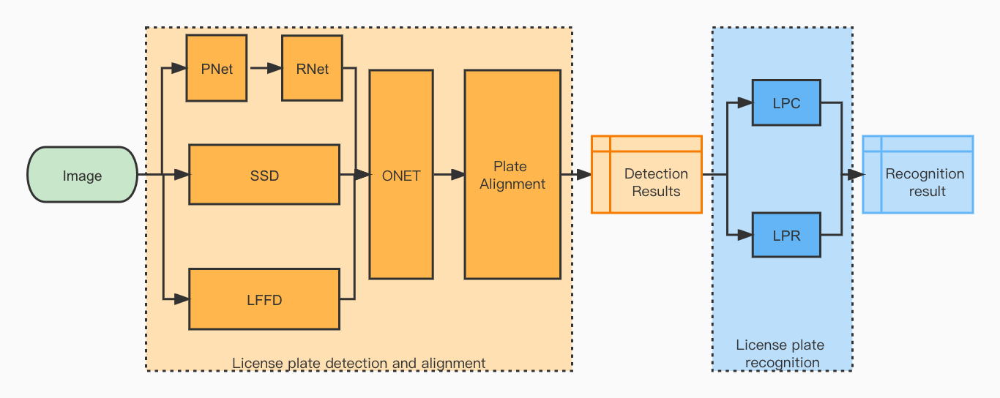
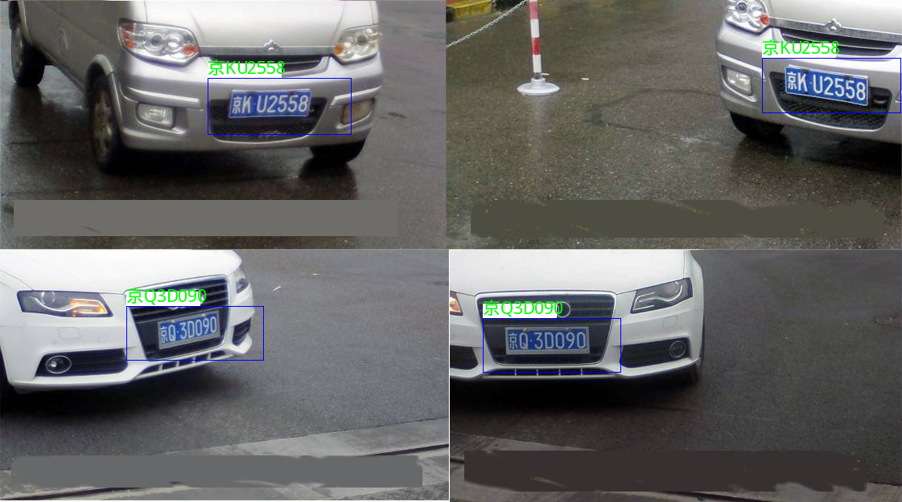
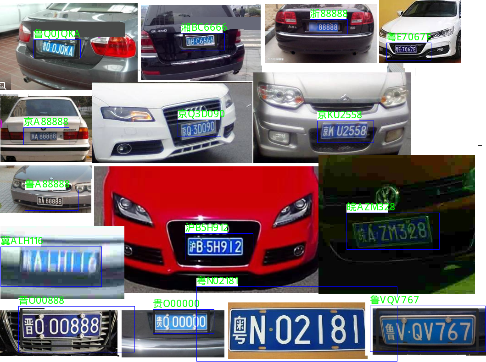
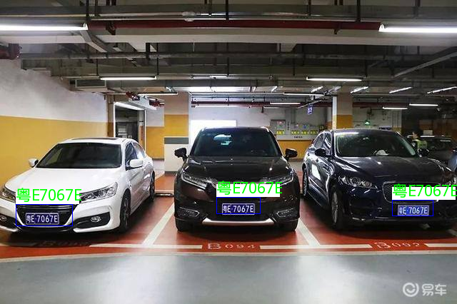
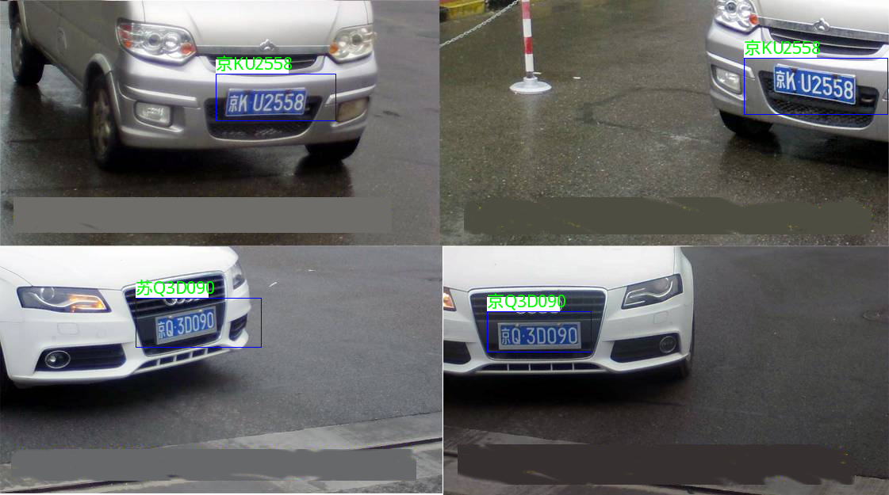

# lpr（license plate recognition）

## 构建及安装

1. 源码准备
- 包括deps，include，models，src文件夹

2. 准备环境
- 安装opencv4.0及以上， freetype库
- 安装cmake3.0以上版本，支持c++11的c++编译器，如gcc-6.3

3. 编译安装
```sh
mkdir build
cd build
cmake ..
make install
```

## 使用及样例
1.使用MTCNN检测
- 代码样例
```cpp
void test_mtcnn_plate(){
    pr::fix_mtcnn_detector("../../models/float", pr::mtcnn_float_detector);
    pr::PlateDetector detector = pr::IPlateDetector::create_plate_detector(pr::mtcnn_float_detector);

    pr::fix_lpr_recognizer("../../models/float", pr::float_lpr_recognizer);
    pr::LPRRecognizer lpr =  pr::float_lpr_recognizer.create_recognizer();
    Mat img = imread("../../image/plate.png");

    ncnn::Mat sample = ncnn::Mat::from_pixels(img.data, ncnn::Mat::PIXEL_BGR, img.cols, img.rows);
    std::vector<pr::PlateInfo> objects;
    detector->plate_detect(sample, objects);
    lpr->decode_plate_infos(objects);

    for (auto pi : objects)
    {
        cout << "plate_no: " << pi.plate_color << pi.plate_no << " box:" << pi.bbox.xmin << ","
        << pi.bbox.ymin << "," << pi.bbox.xmax << "," << pi.bbox.ymax << "," << pi.bbox.score << endl;
    }
}
```


2.使用LFFD检测
- 代码样例
```cpp
void test_lffd_plate()
{
    pr::fix_lffd_detector("../../models/float", pr::lffd_float_detector);
    pr::PlateDetector detector = pr::IPlateDetector::create_plate_detector(pr::lffd_float_detector);

    pr::fix_lpr_recognizer("../../models/float", pr::float_lpr_recognizer);
    pr::LPRRecognizer lpr =  pr::float_lpr_recognizer.create_recognizer();
    Mat img = imread("../../image/plate.png");

    ncnn::Mat sample = ncnn::Mat::from_pixels(img.data, ncnn::Mat::PIXEL_BGR, img.cols, img.rows);
    std::vector<pr::PlateInfo> objects;
    detector->plate_detect(sample, objects);
    lpr->decode_plate_infos(objects);

    for (auto pi : objects)
    {
        cout << "plate_no: " << pi.plate_color << pi.plate_no << " box:" << pi.bbox.xmin << ","
             << pi.bbox.ymin << "," << pi.bbox.xmax << "," << pi.bbox.ymax << "," << pi.bbox.score << endl;
    }
}
```

3.使用SSD检测
- 代码样例
```cpp
void test_ssd_plate()
{
    pr::fix_ssd_detector("../../models/float", pr::ssd_float_detector);
    pr::PlateDetector detector = pr::IPlateDetector::create_plate_detector(pr::ssd_float_detector);

    pr::fix_lpr_recognizer("../../models/float", pr::float_lpr_recognizer);
    pr::LPRRecognizer lpr =  pr::float_lpr_recognizer.create_recognizer();
    Mat img = imread("../../image/manys.jpeg");

    ncnn::Mat sample = ncnn::Mat::from_pixels(img.data, ncnn::Mat::PIXEL_BGR, img.cols, img.rows);
    std::vector<pr::PlateInfo> objects;
    detector->plate_detect(sample, objects);
    lpr->decode_plate_infos(objects);

    for (auto pi : objects)
    {
        cout << "plate_no: " << pi.plate_color << pi.plate_no << " box:" << pi.bbox.xmin << ","
             << pi.bbox.ymin << "," << pi.bbox.xmax << "," << pi.bbox.ymax << "," << pi.bbox.score << endl;
    }
}
```


4.使用量化模型
- 代码样例
```cpp
void test_quantize_mtcnn_plate(){
    pr::fix_mtcnn_detector("../../models/quantize", pr::mtcnn_int8_detector);
    pr::PlateDetector detector = pr::IPlateDetector::create_plate_detector(pr::mtcnn_int8_detector);

    pr::fix_lpr_recognizer("../../models/quantize", pr::int8_lpr_recognizer);
    pr::LPRRecognizer lpr =  pr::int8_lpr_recognizer.create_recognizer();
    Mat img = imread("../../image/plate.png");

    ncnn::Mat sample = ncnn::Mat::from_pixels(img.data, ncnn::Mat::PIXEL_BGR, img.cols, img.rows);
    std::vector<pr::PlateInfo> objects;
    detector->plate_detect(sample, objects);
    lpr->decode_plate_infos(objects);

    for (auto pi : objects)
    {
        cout << "plate_no: " << pi.plate_color << pi.plate_no << " box:" << pi.bbox.xmin << ","
             << pi.bbox.ymin << "," << pi.bbox.xmax << "," << pi.bbox.ymax << "," << pi.bbox.score << endl;
    }
}

```

# LPR （License Plate Recognition）
LPR is a quasi-commercial grade license plate recognition library for mobile, with NCNN as the inference backend, using DNN as the core of the algorithm, supporting a variety of license plate detection algorithms, supporting license plate recognition and license plate color recognition.

## Features

- __Ultra-lightweight__, the core library relies only on NCNN and supports model quantization
- __Multi-detection__, support SSD, MTCNN, LFFD and other target detection algorithms
- __High accuracy__, LFFD target detection reaches 98.9 in CCPD detection AP, license plate recognition reaches 99.95%, comprehensive recognition rate over 99%
- __Easy to use__, only need 10 lines of code to complete license plate recognition
- __Easy to expand__, can quickly expand all kinds of detection algorithms

## Algorithms Flow



## Build and Installation

1. Source code preparation
- incloud ___<font color=#0000FF>deps，include，models，src</font>___ Folders

2. Environment Preparation
- opencv4.0 and above, freetype
- cmake3.0 and above, c++ compiler that supports c++11, such as gcc-6.3

3. Compilation and installation
```sh
mkdir build
cd build
cmake ..
make install
```

## Usage and samples
1.Detection with MTCNN
- Sample Code
```cpp
void test_mtcnn_plate(){
    pr::fix_mtcnn_detector("../../models/float", pr::mtcnn_float_detector);
    pr::PlateDetector detector = pr::IPlateDetector::create_plate_detector(pr::mtcnn_float_detector);

    pr::fix_lpr_recognizer("../../models/float", pr::float_lpr_recognizer);
    pr::LPRRecognizer lpr =  pr::float_lpr_recognizer.create_recognizer();
    Mat img = imread("../../image/plate.png");

    ncnn::Mat sample = ncnn::Mat::from_pixels(img.data, ncnn::Mat::PIXEL_BGR, img.cols, img.rows);
    std::vector<pr::PlateInfo> objects;
    detector->plate_detect(sample, objects);
    lpr->decode_plate_infos(objects);

    for (auto pi : objects)
    {
        cout << "plate_no: " << pi.plate_color << pi.plate_no << " box:" << pi.bbox.xmin << ","
        << pi.bbox.ymin << "," << pi.bbox.xmax << "," << pi.bbox.ymax << "," << pi.bbox.score << endl;
    }
}
```

- Result Example:


2.Detection with MTCNN
- Sample Code
```cpp
void test_lffd_plate()
{
    pr::fix_lffd_detector("../../models/float", pr::lffd_float_detector);
    pr::PlateDetector detector = pr::IPlateDetector::create_plate_detector(pr::lffd_float_detector);

    pr::fix_lpr_recognizer("../../models/float", pr::float_lpr_recognizer);
    pr::LPRRecognizer lpr =  pr::float_lpr_recognizer.create_recognizer();
    Mat img = imread("../../image/plate.png");

    ncnn::Mat sample = ncnn::Mat::from_pixels(img.data, ncnn::Mat::PIXEL_BGR, img.cols, img.rows);
    std::vector<pr::PlateInfo> objects;
    detector->plate_detect(sample, objects);
    lpr->decode_plate_infos(objects);

    for (auto pi : objects)
    {
        cout << "plate_no: " << pi.plate_color << pi.plate_no << " box:" << pi.bbox.xmin << ","
             << pi.bbox.ymin << "," << pi.bbox.xmax << "," << pi.bbox.ymax << "," << pi.bbox.score << endl;
    }
}
```

- Results Example:



3.Detection with SSD
- Sample Code
```cpp
void test_ssd_plate()
{
    pr::fix_ssd_detector("../../models/float", pr::ssd_float_detector);
    pr::PlateDetector detector = pr::IPlateDetector::create_plate_detector(pr::ssd_float_detector);

    pr::fix_lpr_recognizer("../../models/float", pr::float_lpr_recognizer);
    pr::LPRRecognizer lpr =  pr::float_lpr_recognizer.create_recognizer();
    Mat img = imread("../../image/manys.jpeg");

    ncnn::Mat sample = ncnn::Mat::from_pixels(img.data, ncnn::Mat::PIXEL_BGR, img.cols, img.rows);
    std::vector<pr::PlateInfo> objects;
    detector->plate_detect(sample, objects);
    lpr->decode_plate_infos(objects);

    for (auto pi : objects)
    {
        cout << "plate_no: " << pi.plate_color << pi.plate_no << " box:" << pi.bbox.xmin << ","
             << pi.bbox.ymin << "," << pi.bbox.xmax << "," << pi.bbox.ymax << "," << pi.bbox.score << endl;
    }
}
```

- Results Example:



4.Detection with quantitative models
- Sample Code
```cpp
void test_quantize_mtcnn_plate(){
    pr::fix_mtcnn_detector("../../models/quantize", pr::mtcnn_int8_detector);
    pr::PlateDetector detector = pr::IPlateDetector::create_plate_detector(pr::mtcnn_int8_detector);

    pr::fix_lpr_recognizer("../../models/quantize", pr::int8_lpr_recognizer);
    pr::LPRRecognizer lpr =  pr::int8_lpr_recognizer.create_recognizer();
    Mat img = imread("../../image/plate.png");

    ncnn::Mat sample = ncnn::Mat::from_pixels(img.data, ncnn::Mat::PIXEL_BGR, img.cols, img.rows);
    std::vector<pr::PlateInfo> objects;
    detector->plate_detect(sample, objects);
    lpr->decode_plate_infos(objects);

    for (auto pi : objects)
    {
        cout << "plate_no: " << pi.plate_color << pi.plate_no << " box:" << pi.bbox.xmin << ","
             << pi.bbox.ymin << "," << pi.bbox.xmax << "," << pi.bbox.ymax << "," << pi.bbox.score << endl;
    }
}

```

- Results Example:



## Follow-Up works
- Add better algorithm support
- Optimize the model, support more license plate types, currently support common license plate recognition
- Optimize the model, higher accuracy
- Performance evaluation

## Reference
1. [light-LPR](https://github.com/lqian/light-LPR) 
2. [NCNN](https://github.com/Tencent/ncnn) 
3. [LFFD](https://github.com/YonghaoHe/A-Light-and-Fast-Face-Detector-for-Edge-Devices) 
4. [CCPD](https://github.com/detectRecog/CCPD) Chinese license plate dataset, reaching 2 million samples
5. [HyperLPR](https://github.com/zeusees/HyperLPR) 


